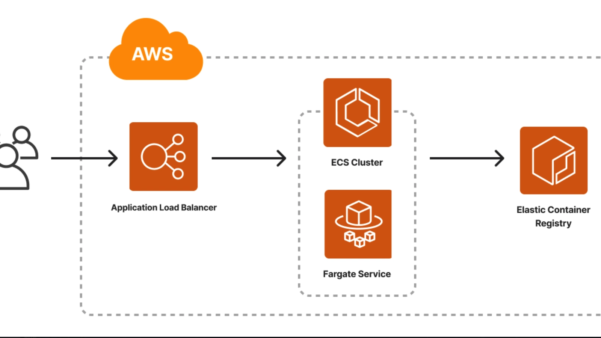
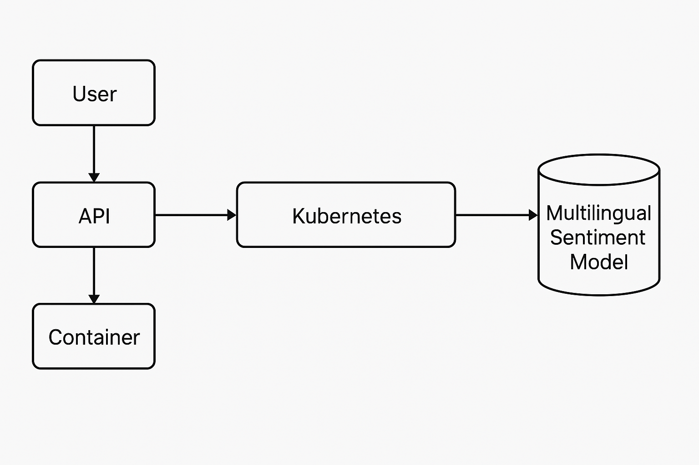

# API de Despliegue de Modelo de Machine Learning con FastAPI

Este proyecto implementa una API RESTful utilizando FastAPI para el despliegue del modelo de machine learning sobre  la renegociación de deudas.

## Tabla de Contenidos  
- [Descripción del Proyecto](#descripción-del-proyecto)
- [Estructura del Proyecto](#estructura-del-proyecto)
- [Instalación](#instalación)
- [Uso](#uso)
- [Dockerización](#dockerización)
- [Despliegue en Kubernetes](#despliegue-en-kubernetes)
- [Contribuciones](#contribuciones)
- [Licencia](#licencia)

## Descripción del Proyecto

Este proyecto implementa un modelo de árbol de decisión para la evaluación de propuestas de renegociación de deudas. El sistema analiza múltiples variables relacionadas con el perfil del deudor y su comportamiento crediticio para determinar la viabilidad de aceptar una propuesta de renegociación, generando un resultado binario que indica la aprobación (1) o rechazo (0) de la solicitud.
Puedes ver la implementación del modelo en [Notebook](notebooks/analisis-de-clientes-bancarios.ipynb "Notebook de análisis")


### Variables de Entrada del Modelo
El árbol de decisión evalúa los siguientes atributos para cada caso:

* ABONO_OFERTADO: Monto propuesto como pago inicial (ej. 53000)
* CONSUMO_SBIF: Indicador de consumo reportado al regulador financiero (ej. 9603)
* EDAD: Edad del deudor (ej. 31)
* SEXO_BIN: Indicador binario de género (1: masculino, 0: femenino)
* SCORE: Puntuación crediticia del cliente (ej. 378)
* DEUDA_PROM3: Deuda promedio de los últimos 3 meses (ej. 992387)
* PROME_UTILIZACION_3MESES: Ratio de utilización de crédito (0-1)
* PROME_LINEA_CREDITO_3MESES: Promedio de línea de crédito disponible (ej. 594)
* PROME_CANT_INSTITUTO_3MESES: Número promedio de instituciones financieras con las que mantiene deuda (ej. 3)
* SUMA_MOROSA_3MESES: Suma de días en mora en los últimos 3 meses (ej. 436)
* Deuda_Char_008: Indicador binario de caracterización de deuda (1: cumple condición, 0: no cumple)
* Pago_Char_008: Indicador binario de comportamiento de pago (1: cumple condición, 0: no cumple)

### Variable de Salida
Resultado binario:
* 1: Aprobar la propuesta de renegociación
* 0: Rechazar la propuesta de renegociación

###  Características principales

* Implementación de árbol de decisión para clasificación binaria
* Evaluación automatizada basada en reglas derivadas del análisis de datos históricos
* Alta interpretabilidad de las decisiones a través de la estructura del árbol
* Capacidad de predecir la probabilidad de éxito de una renegociación

## Requisitos
- Python 3.11+
- FastAPI
- Uvicorn
- Pydantic
- Dependencias específicas del modelo (scikit-learn, TensorFlow, PyTorch, etc.)


## Estructura del Proyecto

La estructura del proyecto es la siguiente:

```
serving-ml-app/
├── .github/
├── cloudformation/
├── container/
│   ├── Dockerfile
│   └── ...
├── data/
├── models/
├── notebooks/
├── src/
│   ├── api/
│   │   ├── __init__.py
│   │   ├── main.py
│   │   └── ...
│   ├── core/
│   ├── models/
│   └── ...
├── .containerignore
├── .dockerignore
├── .gitignore
├── .python-version
├── README.md
├── poetry.lock
└── pyproject.toml
```

## Instalación

Para ejecutar este proyecto localmente, sigue estos pasos:

1. Clonar el repositorio:

```bash
git clone https://github.com/ecaminero/serving-ml-app.git
cd serving-ml-app
```

2. Crear y activar un entorno virtual:

```bash
# En Windows
.\venv\Scripts\activate

# En Linux o macOS
source venv/bin/activate
```

3. Instalar las dependencias:

Este proyecto utiliza [Poetry](https://python-poetry.org/) para la gestión de dependencias:

```bash
poetry install
```

> **¿Usas Windows y ves un error como este?**
> ```
> Current Python version (3.10.10) is not allowed by the project (^3.11)
> ```
> Eso significa que tu sistema tiene otra versión de Python activa.  
> Puedes solucionarlo usando la ruta donde tengas instalado Python 3.11:
>
> ```bash
> poetry env use C:\ruta\a\python311.exe
> ```
>
> Para saber qué rutas tienes disponibles, ejecuta en la consola:
> ```bash
> where python
> ```
> Luego copia la ruta que corresponde a tu Python 3.11 e insértala en el comando anterior.

## Uso

Para iniciar la API localmente:

1. Asegúrate de estar en la raíz del proyecto (donde está el archivo `pyproject.toml`)

2. Ejecuta la aplicación con:

```bash
poetry run fastapi dev src/main.py
```

La API estará disponible en `http://127.0.0.1:8000`.
---

## Prueba de la API

> Este proyecto cuenta con **dos endpoints `/predict` diferentes**, uno para texto libre (modelo NLP) y otro para datos numéricos (modelo estructurado). A continuación se describen ambos.

---

### Prueba del modelo

Mientras el servidor esté corriendo (`uvicorn src.main:app --reload`), no podrás escribir en esa terminal.

Abre una **nueva ventana de consola (CMD o PowerShell)** para ejecutar el siguiente comando:

```bash
curl -X POST "http://127.0.0.1:8000/predict" \
  -H "Content-Type: application/json" \
  -d '{
    "ABONO_OFERTADO": 53000,
    "CONSUMO_SBIF": 9603,
    "EDAD": 31,
    "SEXO_BIN": 1,
    "SCORE": 378,
    "DEUDA_PROM3": 992387,
    "PROME_UTILIZACION_3MESES": 1,
    "PROME_LINEA_CREDITO_3MESES": 594,
    "PROME_CANT_INSTITUTO_3MESES": 3,
    "SUMA_MOROSA_3MESES": 436,
    "Deuda_Char_008": 1,
    "Pago_Char_008": 0
  }'
```

Una vez ejecutado, deberías ver una respuesta similar a:

```json
{
    "id":"3a0d2858-1df1-11f0-a6ef-c2dc360e8a7d",
    "probabilidad":[
        0.7878787878787878, 
        0.21212121212121213
    ]
}
```
---

#### 🔹 Opción 2: Desde el navegador con FastAPI Docs


1. Abre tu navegador y visita: [http://127.0.0.1:8000/docs](http://127.0.0.1:8000/docs)
2. Haz clic en `POST /predict` y luego en **"Try it out"**
3. En el cuerpo del mensaje (`Request body`), pega este ejemplo de JSON:

```json
{
  "ABONO_OFERTADO": 53000,
  "CONSUMO_SBIF": 9603,
  "EDAD": 31,
  "SEXO_BIN": 1,
  "SCORE": 378,
  "DEUDA_PROM3": 992387,
  "PROME_UTILIZACION_3MESES": 1,
  "PROME_LINEA_CREDITO_3MESES": 594,
  "PROME_CANT_INSTITUTO_3MESES": 3,
  "SUMA_MOROSA_3MESES": 436,
  "Deuda_Char_008": 1,
  "Pago_Char_008": 0
}
```

4. Haz clic en **"Execute"**
5. La predicción aparecerá en la sección **Response body**

## Dockerización

1. Construir la imagen Docker:

```bash
docker build -t serving-ml-app -f container/Dockerfile .
```

2. Ejecutar el contenedor:

```bash
docker run -p 8000:8000 serving-ml-app
```

## Arquitectura En AWS



## Opcional: Despliegue en Kubernetes



1. Crear los archivos de configuración de Kubernetes:

- `deployment.yaml`:

```yaml
apiVersion: apps/v1
kind: Deployment
metadata:
  name: serving-ml-app
spec:
  replicas: 2
  selector:
    matchLabels:
      app: serving-ml-app
  template:
    metadata:
      labels:
        app: serving-ml-app
    spec:
      containers:
      - name: serving-ml-app
        image: tu-usuario/serving-ml-app:latest
        ports:
        - containerPort: 8000
```

- `service.yaml`:

```yaml
apiVersion: v1
kind: Service
metadata:
  name: serving-ml-app
spec:
  selector:
    app: serving-ml-app
  ports:
    - protocol: TCP
      port: 80
      targetPort: 8000
  type: LoadBalancer
```

2. Aplicar los archivos:

```bash
kubectl apply -f deployment.yaml
kubectl apply -f service.yaml
```

## Contribuciones

¡Las contribuciones son bienvenidas! Por favor, abre un *pull request* o issue si tienes sugerencias.

## Licencia

Este proyecto está licenciado bajo los términos de la licencia MIT.
