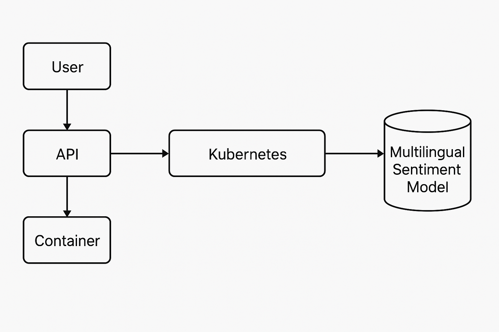

# API de Despliegue de Modelo de Machine Learning con FastAPI

Este proyecto implementa una API RESTful utilizando FastAPI para el despliegue del modelo de machine learning 'multilingual-uncased-sentiment'.
Este modelo, basado en BERT, está optimizado para el análisis de sentimientos en reseñas de productos en seis idiomas: inglés, neerlandés, alemán, francés, español e italiano.
Predice la opinión de la reseña mediante un número de estrellas (entre 1 y 5).

## Tabla de Contenidos

- [Descripción del Proyecto](#descripción-del-proyecto)
- [Estructura del Proyecto](#estructura-del-proyecto)
- [Instalación](#instalación)
- [Uso](#uso)
- [Dockerización](#dockerización)
- [Despliegue en Kubernetes](#despliegue-en-kubernetes)
- [Contribuciones](#contribuciones)
- [Licencia](#licencia)

## Descripción del Proyecto

Esta API permite a los usuarios enviar texto en uno de los seis idiomas soportados y recibir una predicción del sentimiento en forma de estrellas (1 a 5).
Utiliza FastAPI para manejar las solicitudes HTTP y el modelo 'multilingual-uncased-sentiment' para el análisis de sentimientos.

## Estructura del Proyecto

La estructura del proyecto es la siguiente:

```
serving-ml-app/
├── .github/
├── cloudformation/
├── container/
│   ├── Dockerfile
│   └── ...
├── data/
├── models/
├── notebooks/
├── src/
│   ├── api/
│   │   ├── __init__.py
│   │   ├── main.py
│   │   └── ...
│   ├── core/
│   ├── models/
│   └── ...
├── .containerignore
├── .dockerignore
├── .gitignore
├── .python-version
├── README.md
├── poetry.lock
└── pyproject.toml
```

## Instalación

Para ejecutar este proyecto localmente, sigue estos pasos:

1. Clonar el repositorio:

```bash
git clone https://github.com/ecaminero/serving-ml-app.git
cd serving-ml-app
```

2. Crear y activar un entorno virtual:

```bash
python3 -m venv venv
source venv/bin/activate
```

3. Instalar las dependencias:

Este proyecto utiliza [Poetry](https://python-poetry.org/) para la gestión de dependencias:

```bash
poetry install
```

## Uso

Para iniciar la API localmente:

1. Navegar al directorio `src/api/`:

```bash
cd src/api/
```

2. Ejecutar la aplicación:

```bash
uvicorn main:app --reload
```

La API estará disponible en `http://127.0.0.1:8000`.

3. Probar la API:

```bash
curl -X POST "http://127.0.0.1:8000/predict" -H "Content-Type: application/json" -d '{"text": "Esta es una excelente reseña de producto."}'
```


## Prueba de la API

Una vez que la aplicación esté corriendo en `http://127.0.0.1:8000`, puedes probar la API de dos formas:

### 🔹 Opción 1: Desde el navegador con FastAPI Docs

1. Abre tu navegador y visita: [http://127.0.0.1:8000/docs](http://127.0.0.1:8000/docs)
2. Haz clic en `POST /predict` y luego en **"Try it out"**
3. En el cuerpo del mensaje (`Request body`), pega este ejemplo de JSON:

```json
{
  "ABONO_OFERTADO": 53000,
  "CONSUMO_SBIF": 9603,
  "EDAD": 31,
  "SEXO_BIN": 1,
  "SCORE": 378,
  "DEUDA_PROM3": 992387,
  "PROME_UTILIZACION_3MESES": 1,
  "PROME_LINEA_CREDITO_3MESES": 594,
  "PROME_CANT_INSTITUTO_3MESES": 3,
  "SUMA_MOROSA_3MESES": 436,
  "Deuda_Char_008": 1,
  "Pago_Char_008": 0
}
```

4. Haz clic en **"Execute"**
5. La predicción aparecerá en la sección **Response body**

---

### 🔹 Opción 2: Desde la terminal usando curl

```bash
curl -X POST "http://127.0.0.1:8000/predict" ^
 -H "Content-Type: application/json" ^
 -d "{"ABONO_OFERTADO":53000,"CONSUMO_SBIF":9603,"EDAD":31,"SEXO_BIN":1,"SCORE":378,"DEUDA_PROM3":992387,"PROME_UTILIZACION_3MESES":1,"PROME_LINEA_CREDITO_3MESES":594,"PROME_CANT_INSTITUTO_3MESES":3,"SUMA_MOROSA_3MESES":436,"Deuda_Char_008":1,"Pago_Char_008":0}"
```

Esto devolverá una respuesta JSON con la predicción del modelo.


## Dockerización

1. Construir la imagen Docker:

```bash
docker build -t serving-ml-app -f container/Dockerfile .
```

2. Ejecutar el contenedor:

```bash
docker run -p 8000:8000 serving-ml-app
```


## Despliegue en Kubernetes

1. Crear los archivos de configuración de Kubernetes:

- `deployment.yaml`:

```yaml
apiVersion: apps/v1
kind: Deployment
metadata:
  name: serving-ml-app
spec:
  replicas: 2
  selector:
    matchLabels:
      app: serving-ml-app
  template:
    metadata:
      labels:
        app: serving-ml-app
    spec:
      containers:
      - name: serving-ml-app
        image: tu-usuario/serving-ml-app:latest
        ports:
        - containerPort: 8000
```

- `service.yaml`:

```yaml
apiVersion: v1
kind: Service
metadata:
  name: serving-ml-app
spec:
  selector:
    app: serving-ml-app
  ports:
    - protocol: TCP
      port: 80
      targetPort: 8000
  type: LoadBalancer
```

2. Aplicar los archivos:

```bash
kubectl apply -f deployment.yaml
kubectl apply -f service.yaml
```

## Contribuciones

¡Las contribuciones son bienvenidas! Por favor, abre un *pull request* o issue si tienes sugerencias.

## Licencia

Este proyecto está licenciado bajo los términos de la licencia MIT.
